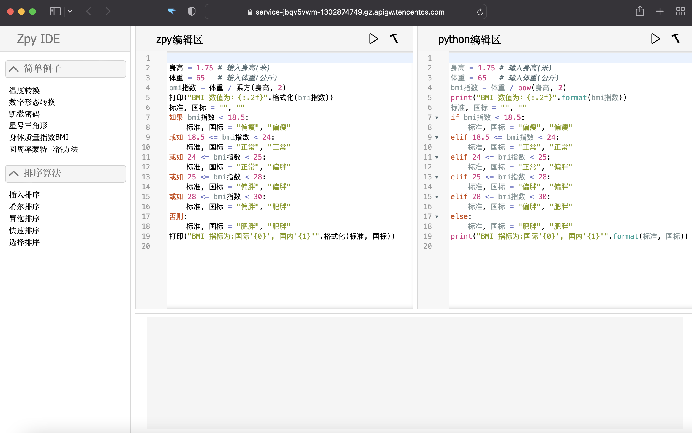

# zpy-ide

## 一、介绍

- 中文编程
- 在线运行
- 与Python语法相同

中文Python编程在线IDE，[在线尝试 - Zpy Online IDE](https://service-jbqv5vwm-1302874749.gz.apigw.tencentcs.com/release/)

<div align="center">
     
</div>

## 二、本地运行

如果你想下载到本地运行，请先确保本地安装有Python3环境

### 1.下载zpy-ide库

``` shell
# 从GitHub下载
git clone https://github.com/louisyoungx/zpy-ide.git
# 从Gitee下载
git clone https://gitee.com/louisyoungx/zpy-ide.git
```

### 2.进入文件夹，安装依赖

``` shell
# 进入文件夹
cd zpy-ide
# 安装依赖Flask
python3 -m pip install flask
```

### 3.启动IDE

``` shell
python3 app.py
```

### 4.打开IDE

使用浏览器访问 http://0.0.0.0:5000/
